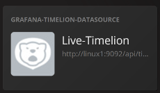
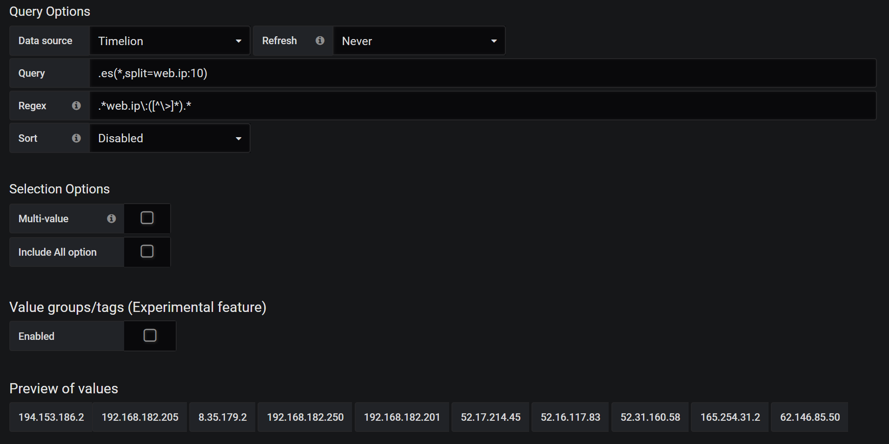
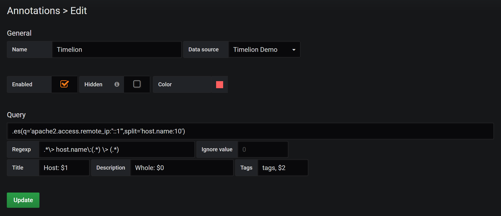
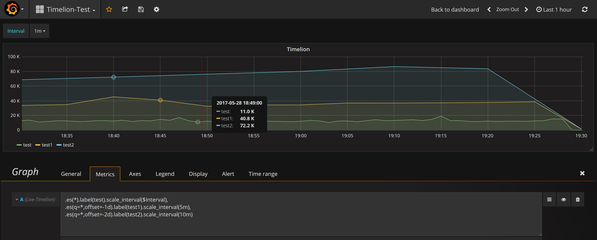

  

# grafana-timelion-datasource 
ELK Timelion's data source for Grafana 

## Setup

Set the url for your ES server like: http://server:port/api/timelion (Same server where your Kibana instance is running)

## Features
### Query

Only query datasource feature is implemented.
Multiple queires can be spceified using same metric like: `.es(*).label(metric1),.es(q=*,offset=1d).label(metric2)`
Or defining multiple metrics.

Refer to Timelion's documentation for more details on writting queries: https://github.com/elastic/timelion/blob/master/FUNCTIONS.md

### Labeling

Use the `label()` function to set the name of the metric

### Interval

Use the `scale_interval()` function to specify metric interval. Grafana templating values are allowed

### Variables
Starting with version 1.0.1 you can retrieve variables from Timelion labels.

### Annotations
You can query annotattions using Timelio as follow:

Notes:
 * Data will be returned a `<label>: <value>` example `q* > host > count: 10`
 * Define a regexp to split label and use capture groups for: title, description,  tags
 * Timelion always returns a data point for each tick in the time range. Use `Ignore value` to discard invalid values. Default value is 0. 

### Screenshot

**have fun!**

## Thanks to
Grafana team and [@bergquist](https://github.com/bergquist)

## *Fueled by <a href="https://github.com/gbrian/repofunding">@repofunding*</a>
